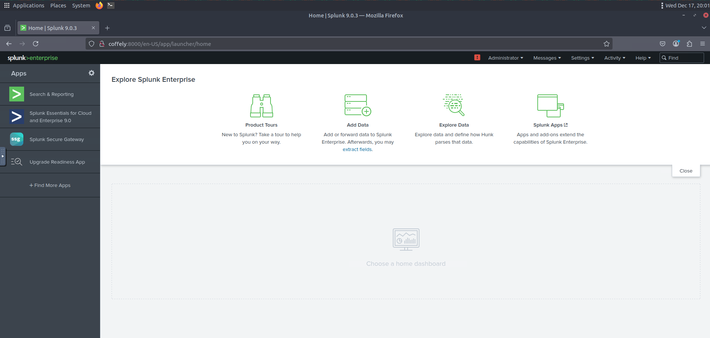

# 🔧 Installation & Configuration

## Overview

This document outlines the installation verification and configuration steps performed to deploy **Splunk Enterprise** and integrate log sources within a SOC-style lab environment.

> **Note:** Splunk Enterprise installer was pre-downloaded on the Linux host as part of the lab environment due to not having an internet connection.

---

## 1. Splunk Installation Verification (Linux)

### Objective

Install Splunk enterprise and ensure that it is properly running.

### Steps Taken in executed order

1. CD into the downloads folder were the Splunk Installer was located
2. Once in the proper directory I gave myself sudo permissions then executed the install command (_tar xvzf splunk_installer.tgz_)
3. The install was succesful so I moved the installed folder to the recommended 'opt' directory using the (_mv splunk /opt/_) command
4. I navigated to the new location using (_cd /opt/splunk/bin_) then executed the run command (_./splunk start --accept-license_)
5. Once the setup process was completed Splunk required a username where I used (splunkadmin) for testing purposes.
6. I completed the setup process by entering a password, after which the service came online.
7. I then navigated to the local domain address which is (http://coffely:8000)

### Commands Used

```bash
sudo su
tar xvzf splunk_installer.tgz
mv splunk /opt/
cd /opt/splunk/bin
./splunk start --accept-license
```

### Results

* Splunk service starts successfully
* Web interface becomes accessible on port `8000`

---

## 2. Accessing Splunk Web Interface

### Objective

Confirm Splunk Web is reachable and functional.

* Accessed Splunk Web at:

  ```
  http://coffely:8000
  ```
* Logged in using admin credentials

📸 **Screenshot:** Splunk Enterprise main page


---

## 3. Splunk Configuration (Linux)

### Listening Port Configuration

Configured Splunk to receive forwarded logs on TCP port `9997`.

* Settings → Forwarding and Receiving → Configure Receiving

📸 **Screenshot:** Receiving port configuration

---

## 4. Universal Forwarder Installation

### Objective

Install and configure Universal Forwarder on log source host.

### Steps Taken in executed order

1. Navigated to the downloads folder and gave myself needed sudo permissions using (_sudo su_)
2. Next I began the installation of the forwarder using the command (_tar xvzf splunkforwarder.tgz_)
3. Once installation was complete I moved the folder to the recomended opt folder using the command (_mv splunkforwarder /opt/_)
4. Next I navigated to the new folder location and then ran the forwarder using the command (_./bin/splunk start --accept-license_)
5. I filled in all required user information and changed the port to 8090 because the default port (8089) was already in use by the Splunk Enterprise host.

#### Linux Host

* Installed forwarder package
* Configured forwarding destination

📸 **Screenshot:** Forwarder installation confirmation

---

---

## 7. Troubleshooting & Challenges

### Issues Encountered

* Service startup delays
* Initial port connectivity issues

### Resolutions

* Restarted Splunk service
* Verified firewall and listening ports

📸 **Screenshot:** Error message and resolution confirmation

---

## 8. Skills Demonstrated

* SIEM deployment and configuration
* Log ingestion via Universal Forwarders
* Splunk search and validation
* Troubleshooting service and network issues
* SOC-style documentation practices

---
